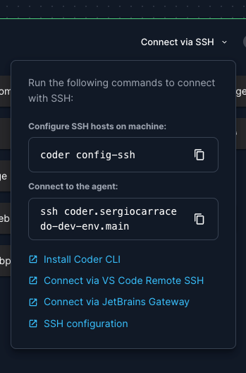

# Using factorial one "source"

## Motivation

For development scenarios is necessary to be agile and be able to apply changes in factorial one and check how then
integrates in the consumer (ex. factorial's monorepo)

In this scenario the regular release process (build, publish, update dependency's version on the consumer and update) is
very slow and doesn't provide a fast feedback of the
changes.

Use the `factorial-one`'s source as dependencies has a lot of tradeoffs and issues: aliases, vite plugins, etc. needs to
be configured in the same way in the consumer of `factorial-one`

### Strategy

Building the library will be necessary to use it in the same way as in production, but in some scenarios (like local
development) we can skip publishing and reinstalling (check how to: [in local development](#local)
or [in coder](#coder))

## How to

### Using an specific commit

Check [release and versioning](release-and-versioning.md) for more information about the versioning and the commit and
how to use it in local

> IMPORTANT: Remember to remove use a stable version before to merge into `main` or release

### How to use local version of `factorial-one` in your local repo (ex. `factorial`'s monorepo) {#local}

This applies when both `factorial-one` and `factorial`'s monorepo are in the local computer

1. Go to the `factorial-one` folder: `cd factorial-one`
2. Run `pnpm build:watch` to rebuild the project on any change
3. Run `pnpm link --global` to add the package to the local links
4. Go to the factorial app monorepo: `cd factorial/frontend`
5. Run `pnpm link --global @factorialco/factorial-one` to use the local version of the package

### How to use local version of `factorial-one` in coder {#cder}

This applies when `factorial-one` is in your local computer and `factorial`'s monorepo is in coder's dev environment

**Prerequisites:**

- [rsync](https://linux.die.net/man/1/rsync) in your local computer: `brew install rsync`
- [coder cli](https://coder.com/docs/getting-started/installation) in your local computer
    - 
- Create if not exists `.env.local` and add this line `CODER_REMOTE=[YOUR_CODER_SSH_CONNECTION_STRING]`, for example:
  `CODER_REMOTE=coder.sergiocarracedo-dev-env`
  > This file is in the `.gitignore` file, so it won't be pushed to the repository

**Steps:**

1. Go to the `factorial-one` folder: `cd factorial-one`
2. Run `pnpm dev:coder` to rebuild the project on any change and sync that build to coder workspace

> Now on each change in the `factorial-one`'s source code, the changes will be reflected in the coder workspace and the
> frontend will be reloaded using always the latest `factorial-one`'s code

